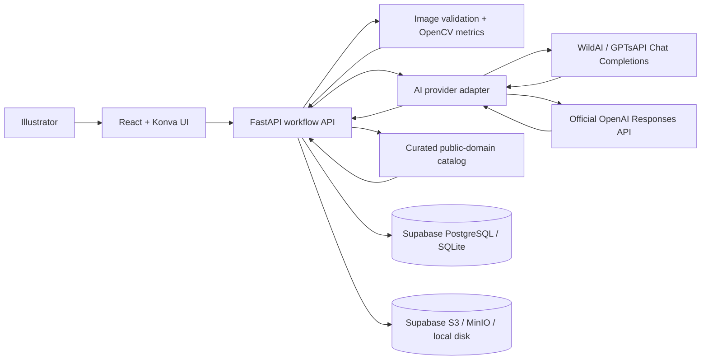

# Architecture

ArtMentor is a modular monolith: one React client and one FastAPI application, with replaceable AI, storage, and database adapters. This keeps the MVP understandable for a student team while preserving clean seams for later experiments.

## Workflow boundary

1. Upload validates format, size, and pixels, then stores the original.
2. Intent restatement is a text-only structured call. The artist edits and confirms it.
3. Critique computes deterministic metrics and sends the image, confirmed intent, style, stage, and metrics to the vision model.
4. The model returns a strict `CritiqueCore`. The backend assigns stable suggestion IDs and joins three references from a curated public-domain catalog.
5. Annotation edits are saved as normalized coordinates, independent of screen or original image size.
6. Feedback stores the suggestion, verdict, and optional reason. “Intentional” is a first-class label.
7. Revision comparison sends original and revised images together, then records four explicit outcomes.

## Public-demo boundary

- An anonymous HttpOnly cookie is hashed into an owner ID; every private database lookup includes that owner ID.
- Uploaded media is served through an ownership-checked API route rather than a public bucket URL.
- An optional access code protects the shared AI budget without putting a secret in the frontend bundle.
- Per-IP upload and AI-call limits plus a small concurrency semaphore reduce accidental overload on free hosting.
- Hugging Face local disk is treated as disposable. Supabase PostgreSQL and private S3-compatible storage hold all durable state.

## Why the hybrid visual pipeline

The multimodal model is good at semantic reading and art-language explanation but may be inconsistent at exact geometry. OpenCV provides reproducible evidence, while editable rectangles let the user correct grounding errors. The UI records whether results came from WildAI / GPTsAPI, official OpenAI, or the deterministic demo provider.

## AI provider boundary

- `AI_PROVIDER=gptsapi` uses `https://api.gptsapi.net/v1/chat/completions`, standard `image_url` message parts, schema-instructed JSON, and Pydantic validation.
- `AI_PROVIDER=openai` keeps the official Responses API path with native parsed structured outputs.
- `AI_PROVIDER=demo` never makes a network call. Provider failures may also fall back to this mode when explicitly enabled.
- Third-party and official keys use separate environment variables, so switching providers never requires overwriting another credential.

## Upgrade seams

- Move long model calls to Celery/Redis without changing response schemas.
- Replace the curated catalog with museum API ingestion plus embedding retrieval.
- Add SAM/Grounding DINO only when more exact object masks are justified by evals.
- Replace anonymous sessions with account authentication and self-service deletion when the project needs long-term user accounts.
- Version prompts and run an evaluation set before model or prompt changes.
