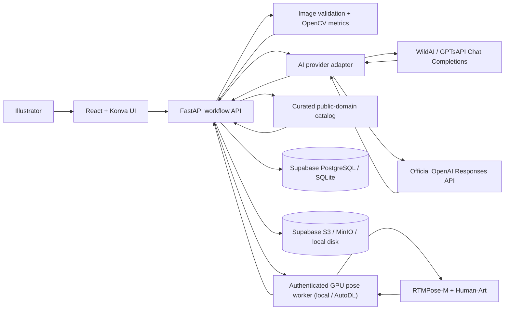

# Architecture

ArtMentor is a modular monolith: one React client and one FastAPI application, with replaceable AI, storage, and database adapters. This keeps the MVP understandable for a student team while preserving clean seams for later experiments.

## Workflow boundary

1. Upload validates format, size, and pixels, then stores the original.
2. A visual context audit separates visible facts from uncertain action hypotheses and checks whether the declared stage appears plausible. The artist confirms or edits the action, stage, and intent.
3. Critique computes deterministic metrics and sends the image plus confirmed context to the vision model with a stage-specific rubric.
4. The model returns a strict `CritiqueCore`. The backend assigns stable suggestion IDs and joins three references from a curated public-domain catalog.
5. Annotation edits are saved as normalized coordinates, independent of screen or original image size.
6. Feedback stores the suggestion, verdict, and optional reason. “Intentional” is a first-class label.
7. Revision comparison sends original and revised images together, then records four explicit outcomes.
8. When the pose feature is enabled, figure-related stages open an artwork
   self-check by default. It estimates one COCO-17 skeleton, exposes every joint
   for correction/visibility editing, and refuses to check until the artist
   confirms the evidence. Deployments without a ready GPU worker hide this entry.
9. Reference body checking remains the more precise mode: it stores a trusted
   reference, frames one person in each image, confirms both skeletons, and then
   runs deterministic relative geometry checks.

## Pose-check boundary

- Torch, MMCV, MMPose, and CUDA stay in a persistent GPU worker. It may run on
  loopback for development or behind an authenticated HTTPS endpoint on AutoDL;
  the web backend talks to it over a small JSON contract.
- Only the backend receives the worker URL and Bearer token. Neither value is
  returned by the session API or bundled into frontend code.
- The worker returns localization evidence only. It never decides whether anatomy is correct.
- Every platform inference appends image hash, crop, model, device, latency, and
  confidence summary to a configurable JSONL log. The submitted image is not
  retained by the worker.
- The backend persists both model snapshots and user-corrected skeletons. Moving a point invalidates the previous comparison.
- Artwork-only and reference-based checks use separate records, so absence of a
  reference no longer prevents the uploaded work from reaching RTMPose.
- Comparison is refused until both skeletons are confirmed. Results are phrased as differences from the selected reference, with realistic, semi-realistic, stylized, and intentional-distortion tolerance profiles.
- The reference checker covers normalized limb lengths, elbow/knee angles, and
  shoulder/hip axes. The no-reference checker uses intentionally broader
  thresholds for segment ratios, projected asymmetry, and support alignment. It
  does not prove 3D volume, foreshortening, contour anatomy, balance, or
  absolute correctness.

## Public-demo boundary

- An anonymous HttpOnly cookie is hashed into an owner ID; every private database lookup includes that owner ID.
- Uploaded media is served through an ownership-checked API route rather than a public bucket URL.
- An optional access code protects the shared AI budget without putting a secret in the frontend bundle.
- Per-IP upload and AI-call limits plus a small concurrency semaphore reduce accidental overload on free hosting.
- Hugging Face local disk is treated as disposable. Supabase PostgreSQL and private S3-compatible storage hold all durable state.

## Why the hybrid visual pipeline

The multimodal model is good at semantic reading and art-language explanation but may be inconsistent at exact geometry. OpenCV provides reproducible evidence, while editable rectangles let the user correct grounding errors. The UI records whether results came from WildAI / GPTsAPI, official OpenAI, or the deterministic demo provider.

## AI provider boundary

- `AI_PROVIDER=gptsapi` uses `https://api.gptsapi.net/v1/chat/completions`, standard `image_url` message parts, schema-instructed JSON, and Pydantic validation.
- `AI_PROVIDER=openai` keeps the official Responses API path with native parsed structured outputs.
- `AI_PROVIDER=demo` never makes a network call. Provider failures may also fall back to this mode when explicitly enabled.
- Third-party and official keys use separate environment variables, so switching providers never requires overwriting another credential.

## Upgrade seams

- Move long model calls to Celery/Redis without changing response schemas.
- Replace the curated catalog with museum API ingestion plus embedding retrieval.
- Add SAM/Grounding DINO only when more exact object masks are justified by evals.
- Replace anonymous sessions with account authentication and self-service deletion when the project needs long-term user accounts.
- Version prompts and run an evaluation set before model or prompt changes.
